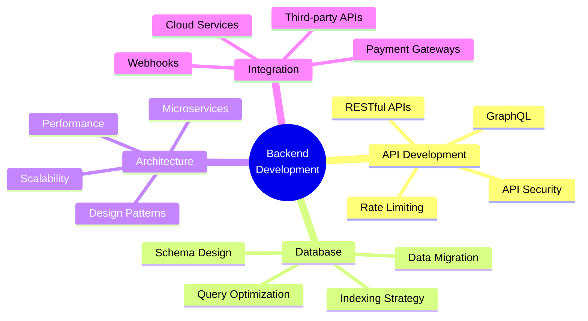

<div align="center">
  
</div>

<h3 align="center">🚀 Architecting Mission-Critical Government Systems | Enterprise ERPs | AI-Driven IoT Infrastructure</h3>

<p align="center">
  <a href="https://github.com/adindamochamad"></a>
  <a href="https://github.com/adindamochamad"></a>
</p>

---

### 👨‍💻 About Me

```typescript
const panca = {
    name: "Panca",
    role: "Backend Engineer",
    specialty: "Mission-Critical Systems Architecture",
    
    experience: [
        "Government Systems Architecture",
        "Enterprise ERP Solutions",
        "AI-Driven IoT Infrastructure",
        "Autonomous AI Agents & Payment Systems"
    ],
    
    expertise: {
        languages: ["PHP", "Python", "R", "C++", "JavaScript"],
        databases: ["MySQL", "PostgreSQL", "Redis"],
        frameworks: ["Laravel", "FastAPI", "Django"],
        focus: [
            "Scalable Architecture",
            "API Development", 
            "Database Optimization",
            "AI Integration",
            "Payment Infrastructure"
        ]
    },
    
    currentProjects: {
        omnibridge: "AI agent for legacy serial device protocols",
        AgentPay: "Payment infrastructure for autonomous AI agents",
        codebuddy: "AI Coding Tutor for Indonesian students",
        guardrailAI: "Guardrail platform for AI-generated code"
    },
    
    philosophy: "Building robust, scalable solutions that power mission-critical systems 
                 and drive real-world impact through innovative technology."
};
```

### 🛠️ Tech Stack

<details open>
<summary><b>Languages</b></summary>
<br>


</details>

<details open>
<summary><b>Backend & Databases</b></summary>
<br>


</details>

<details open>
<summary><b>Tools & Platforms</b></summary>
<br>


</details>

### 📊 GitHub Analytics

<p align="center">
  
  
</p>

<p align="center">
  
</p>

### 🏆 GitHub Trophies

<p align="center">
  
</p>

### 💼 Core Competencies



### 🚀 Featured Projects

<table>
<tr>
<td width="50%">

**🤖 [OmniBridge](https://github.com/adindamochamad/omnibridge)** ⭐ 41

AI agent that identifies legacy serial device protocols autonomously. Built for Claude Opus 4.7 Hackathon 2026.

`Svelte` `AI` `IoT` `Protocol Analysis`

</td>
<td width="50%">

**💳 [AgentPay](https://github.com/adindamochamad/AgentPay)**

Production-grade payment infrastructure for autonomous AI agents with Ed25519-signed escrow transactions.

`Python` `Payment Systems` `Blockchain` `Security`

</td>
</tr>
<tr>
<td width="50%">

**📚 [CodeBuddy](https://github.com/adindamochamad/codebuddy)** ⭐ 1

AI Coding Tutor untuk Pelajar Indonesia, powered by Gemma 4. Google Gemma 4 Good Hackathon 2026.

`Python` `AI` `Education` `Gemma`

</td>
<td width="50%">

**🛡️ [Guardrail AI](https://github.com/adindamochamad/guardrail-ai)**

Platform guardrail untuk kode hasil AI — deteksi, analisis risiko, integrasi CI.

`Python` `AI Safety` `Code Analysis` `CI/CD`

</td>
</tr>
</table>

### 🎯 What I Do Best

- **🏛️ Mission-Critical Systems**: Architecting government systems and enterprise ERPs that demand 99.9% uptime and bulletproof security
- **🤖 AI Integration**: Building AI-driven IoT infrastructure and autonomous agent payment systems
- **🔧 Scalable APIs**: Designing RESTful and GraphQL APIs that handle millions of requests with sub-100ms response times
- **💾 Database Mastery**: Query optimization, schema design, and data integrity for enterprise-scale applications
- **⚡ Performance Engineering**: Identifying bottlenecks and implementing solutions that 10x system performance
- **🔗 Complex Integrations**: Seamlessly connecting legacy systems, third-party APIs, and modern cloud services

### 📫 Let's Connect

<p align="center">
  <a href="https://adindamochamad.com"></a>
  <a href="https://linkedin.com/in/adindapanca"></a>
  <a href="https://twitter.com/adindacq"></a>
  <a href="mailto:contact@adindamochamad.com"></a>
</p>

---

<p align="center">
  <i>⚡ "The best way to predict the future is to architect it" - Panca</i>
</p>

<p align="center">
  <i>Building systems that matter. One commit at a time.</i>
</p>

<p align="center">
  
</p>
